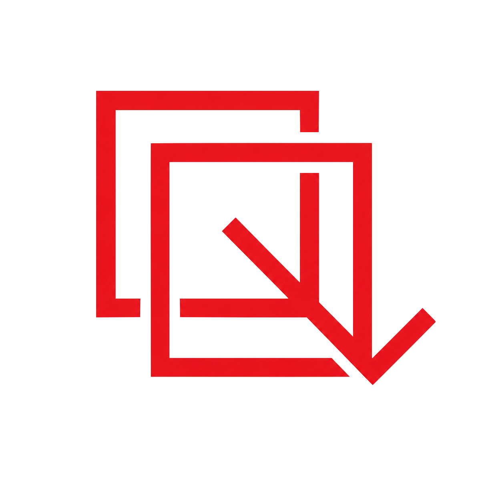

  

<h1 align="center">RedCheck 🔍</h1>

  <b>Lightweight evaluation engine for LLM outputs, hallucination detection, and enterprise telemetry.</b>

  
  <img src="https://img.shields.io/badge/python-3.10